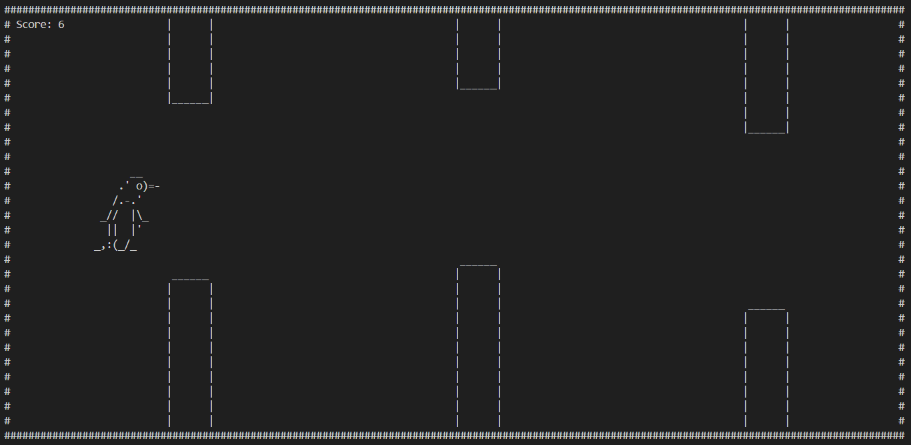
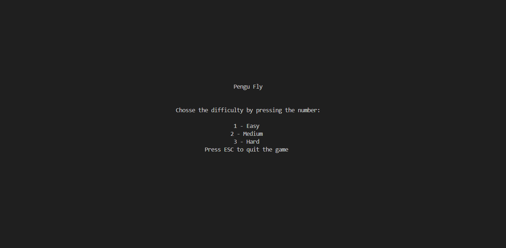

Pengu Fly is a terminal-based ASCII game where you control a flying penguin navigating through walls. It's inspired by Flappy Bird but with its own unique penguin charm!

## Game Description

Help Pengu navigate through an endless series of walls by carefully timing your jumps. Each successfully cleared wall earns you points. The game features smooth animations, physics-based movement, and increasing difficulty levels.



## Features

- Terminal-based ASCII graphics with penguin animations
- Physics-based movement with gravity and jumping mechanics
- Three difficulty levels: Easy, Medium, and Hard
- Score tracking
- Pause functionality
- Collision detection
- Game state screens (start, pause, game over)

## How to Play

1. Run the game using _exec.cmd or by executing `python3 flying_pengu_clean.py`
2. Select your difficulty level (1-Easy, 2-Medium, 3-Hard)

3. Use the following controls:
   - **SPACE**: Make Pengu jump/fly
   - **ESC**: Pause the game
   - **ENTER**: Resume game or restart after game over

The goal is to navigate Pengu through as many walls as possible without colliding. Your score increases with each wall you successfully pass through.

## Installation

### Prerequisites
- Python 3.x
- curses library (included with Python on most systems; for Windows users, install windows-curses)
- NumPy

### Setup
1. Clone the repository
2. Install required packages:
   ```
   pip install numpy
   ```
   On Windows, you may also need:
   ```
   pip install windows-curses
   ```

## Project Structure

- flying_pengu.py: Main game file with game loop and logic
- penguin.py: Defines the Penguin class with animation states
- wall.py: Implements the Wall class for generating walls with openings
- helper_functions.py: Utility functions for drawing and game logic
- _exec.cmd: Windows batch file to set terminal size and run the game

## Game Mechanics

- **Physics**: The penguin falls due to gravity and jumps when the space key is pressed
- **Walls**: Randomly generated walls with openings appear at regular intervals
- **Collision**: The game ends when Pengu hits a wall
- **Scoring**: You earn one point for each wall you successfully navigate through
- **Difficulty**: Higher difficulties feature smaller openings, faster game speed, and less distance between walls

## Development

The game is built using:
- The `curses` library for terminal manipulation
- NumPy for efficient array operations
- Object-oriented programming principles for game entities

## Improvements

The files `flying_pengu_clean.py` and `flying_pengu.py` are the same game, but the former has been cleaned up and refactored for better readability and maintainability by Claude 3.7 Sonnet Thinking (preview).

The file `flying_pengu_optimiert.py` is an optimized version of the game with improved performance and less functionality again by Claude 3.7 Sonnet Thinking (preview).

## License

This project is open-source and available under the MIT License.

## Contributors

Athens Project Team 2025:
- Daniel Büttner
- Julian Maurerlehner
- Nicolas Ung


Enjoy playing Pengu Fly!